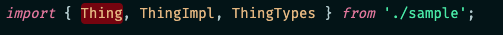
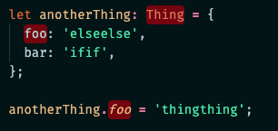

# AlphaBETA

AlphaBETA highlights usage of APIs that use `@internal`, `@alpha`, and `@beta` in their JSDoc.

## Motivation

If you work with library code that is in development it's likely that some parts of the code are in various stages of readiness.  The majority of APIs might be fully released to the public.  But some APIs might be nearly ready to release, and another API might have been added very recently and clearly isn't ready for public use.  And another API might be meant for internal use entirely.  

When all of these APIs are mixed together in one package, it can be very difficult to tell if the APIs that you're using are actually ready for you.  [Hyrum's Law](https://www.hyrumslaw.com/) says that eventually, anything that _can_ be done with a system *will* be done with the system.  That's especically true in languages like JavaScript.  

In an attempt to limit the damage, some package authors adopt a convention of using [JSDoc](https://jsdoc.app/) tags to indicate the state of each API.  Typically this means that API authors will add `@alpha`, `@beta`, or `@internal` to the header comment for a class, interface, method, enum, etc...

This helps, but the problem is that you'll only see those annotations if you're actually looking at the intellisense tooltip.  And it's extremely likely that you'll overlook a stray `@alpha` tag or two if you're not being unreasonably cautious.

With AlphaBETA, it's impossible to miss.

## Running

After cloning the repo, run `npm install` and then open the root directory in Visual Studio Code.

Either press F5 or launch `Run Extension` from the *RUN AND DEBUG* window.

This will launch a new instance of Visual Studio Code with the extension enabled.

Open any javascript or typescript file that is using an API annotated with `@alpha`, `@beta`, or `@internal` attributes.  Wait a few seconds for the extension to initialize, and then the api calls should turn red.

## Extension Settings

AlphaBETA provides the following settings:

* `AlphaBETA.control.showAnnotations`: enable/disable - overrides the `phase` settings below
* `AlphaBETA.control.refreshInterval`: controls how often AlphaBETA scans your code and updates the highlighting
* `AlphaBETA.phase.showInternal`: enable/disable highlighting of `@internal` symbols
* `AlphaBETA.phase.showAlpha`: enable/disable highlighting of `@alpha` symbols
* `AlphaBETA.phase.showBeta`: enable/disable highlighting of `@beta` symbols
* `AlphaBETA.reporting.showInStatusBar`: enable/disable status bar item showing count of prerelease items in current file.
* ``

## Known Issues

Nothing yet.  Please file some!

## Release Notes

Users appreciate release notes as you update your extension.

### 1.0.0

Initial release of AlphaBETA

### 1.1.0

Lower minimum VS Code version to ^1.55.0

